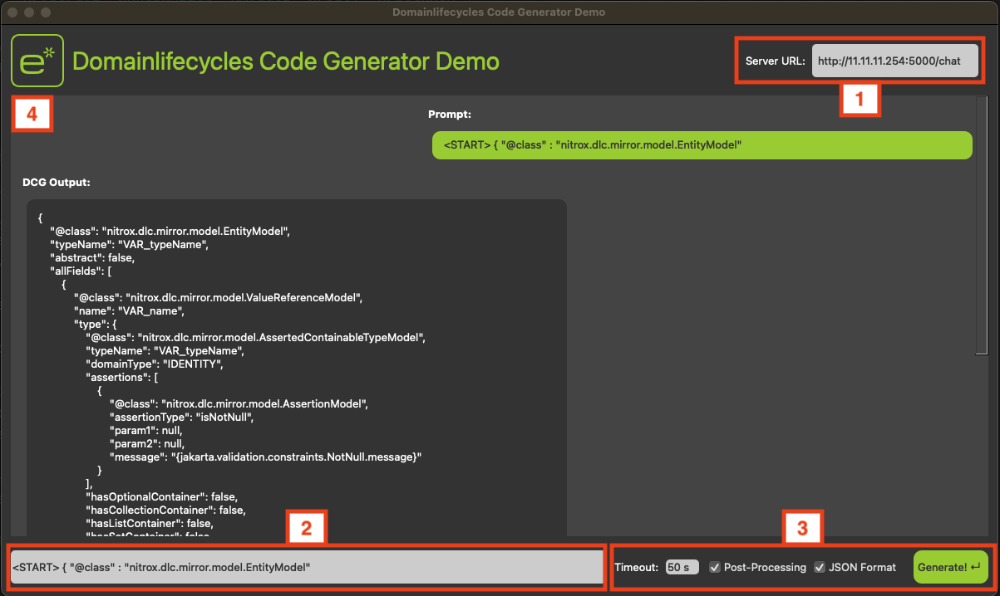

# DCG-DemoApp
The DCG Demo App is an application which is a frontend and server for the showcasing of the Domainlifecycles Code Generator (DCG) model which was developed as part of my master thesis at esentri. 
This repository is a decoupling from the main repository [DomainlifecyclesCodeGenerator](https://github.com/Tr33Bug/DomainlifecyclesCodeGenerator) in which the entire development of the model is documented. 

## Overview
This repository contains a basic PyQT app with a flask server to run the fine-tuned DCG model, showcasing the code generation.

```bash
DCG-DemoApp
├──images
│   ├── DCGAppUIUsage.png
│   └── e-mit-stern-grün.svg
├──models
│   └──finalTraining_v1
│   │   ├── adapter_config.json
│   │   ├── adapter_model.safetensors
│   │   ├── generation_config.json
│   │   └── training_args.bin
├── DCG_Client.py
├── DCG_Server.py
└── README.md
```

## Installation and Setup

This application consists of two parts: `DCG_Client.py` and `DCG_Server.py`. Follow the steps below to get started.

### 1. Setting Up DCG_Server

1. **Clone the Repository**  
   On your Nvidia GPU PC or Server Host, clone the repository:
   ```bash
   git clone git@github.com:Tr33Bug/DCG-DemoApp.git
   cd DCG-DemoApp/DCG_Server
   ```

2. **Install the Requirements**  
   Install the necessary Python packages:
   ```bash
   pip install flask transformers
   pip3 install torch torchvision torchaudio

   ```
   >*PyTorch problems: If you have problems when installing or running pytotch use the installation instructions for your system from the homepage: [pytorch.org](https://pytorch.org/)*

3. **Start the Server**  
   Run the server application:
   ```bash
   python server.py
   ```
   You will be prompted with the host IP once the server is up and running.

### 2. Setting Up DCG_Client

1. **Clone the Repository**  
   On your client device, clone the repository:
   ```bash
   git clone https://github.com/your-username/your-repo.git
   cd your-repo/DCG_Client
   ```

2. **Install the Requirements**  
   Install the necessary Python packages:
   ```bash
   pip install PyQt5
   ```

3. **Start the Client**  
   Run the client application:
   ```bash
   python client.py
   ```

Now, you should have the `DCG_Server` running on your server host and the `DCG_Client` running on your client device, ready for use.


## Usage


1. **Server Settings:**
    - In this text field you must enter the IP address with the port and the `/chat` as the interface on which the server is running. 
    - If the server and client are running on the same host, `127.0.0.1` can be used here. 
2. **Prompt Input:**
    - The prompt for the DCG is entered in this text field. 
    - The DCG is trained on next token generation and therefore the prompt is the start of the generated JSON object. 
    - Best practice for generation is to begin the prompt with <START>, as this token was also used as the start token during training. 
    - It is also advisable to specify the entire class to be generated in order to increase the quality of the generated JSON objects. 
    - Example prompts for all different domain lifecycle objects formally NitroX objects:
        - EntityModel: `<START> { "@class" : "nitrox.dlc.mirror.model.EntityModel"`
        - ValueObjectModel: `<START> { "@class" : "nitrox.dlc.mirror.model.ValueObjectModel"`
        - AggregateRootModel: `<START> { "@class" : "nitrox.dlc.mirror.model.AggregateRootModel"`
        - IdentityModel: `<START> { "@class" : "nitrox.dlc.mirror.model.IdentityModel"`
        - EnumModel: `<START> { "@class" : "nitrox.dlc.mirror.model.EnumModel"`
        - DomainServiceModel: `<START> { "@class" : "nitrox.dlc.mirror.model.DomainServiceModel"`
        - RepositoryModel: `<START> { "@class" : "nitrox.dlc.mirror.model.RepositoryModel"`
        - ApplicationServiceModel: `<START> { "@class" : "nitrox.dlc.mirror.model.ApplicationServiceModel"`
        - DomainEventModel: `<START> { "@class" : "nitrox.dlc.mirror.model.DomainEventModel"`
        - DomainCommandModel: `<START> { "@class" : "nitrox.dlc.mirror.model.DomainCommandModel"`
3. **Settings:**
    - **Timeout** sets the time the client waits for the server to respond. 
    - **Post-Processing** describes the closing and cleaning up of the JSON objects. (See `postprocessing()` function in [DSG_Client.py](DSG_Client.py) line 17.)
    - With **JSON Format** the generated JSON is parsed. If parsing is successful, the JSON is formatted and displayed in the output window. If errors occur, the raw generated JSON is displayed with the corresponding error in the output window. 
    - JSON generation is started with the **Generate!** button. This sends a POST request to the server. 
4. **Output Window**
    - In the output window, the prompt and the DCG output are displayed in a chat history design. 
    - The history is deleted when the app is restarted. 

## Contributing
This project is not being actively developed further. The demo application was only used to demonstrate the results of my master thesis and the Domainlifecycles Code Generator (DCG), formally NitroX Code Generator (NCG).

For questions or suggestions please open an issue.

## Acknowledgements
- **Filip Stepniak** ([feelsteps](https://github.com/feelsteps)) - Supervisor from [esentri](https://esentri.com/)
- **Mario Herb** ([chuckson](https://github.com/chuckson))- Supervisor from [esentri](https://esentri.com/)
- **Prof. Patrick Baier** ([pabair](https://github.com/pabair)) - Supervising professor from [Hochschule Karlsruhe - University of Applied Sciences](https://www.h-ka.de/)


## License
This project is licensed under the MIT License - see the [LICENSE](LICENSE) file for details.